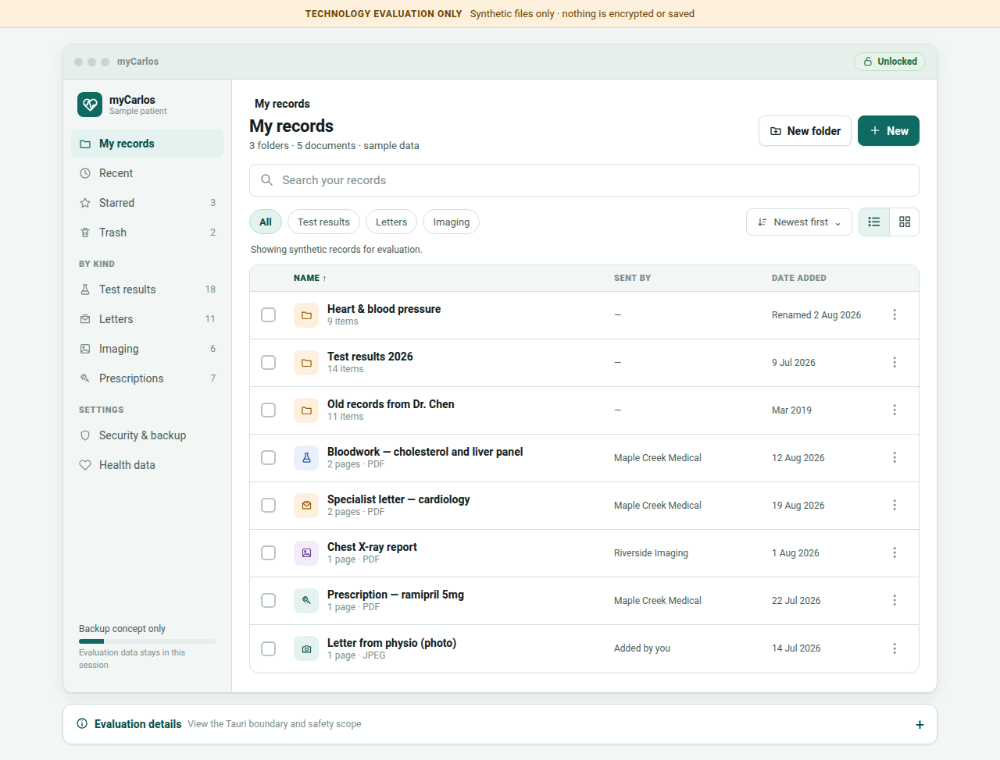
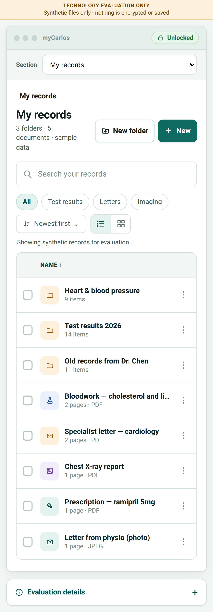

# myCarlos Tauri evaluation

> **Synthetic-data development only — do not use real patient files.** The native app now includes
> an encrypted durable-vault vertical slice, but it has not passed the security, privacy, signing,
> physical-device, or release gates required for PHI. It is not connected to CARLOS EMR.

**[Download the Windows evaluation build](https://github.com/carlos-emr/mycarlos/actions/workflows/mycarlos.yml?query=branch%3Afeat%2Finitial-tauri-vault)**
— open the newest run with a successful **Windows native build** job and select
**myCarlos-Windows-x64-Evaluation** under Artifacts
(GitHub sign-in required). Extract the ZIP, run `myCarlos-Evaluation-Windows-x64-setup.exe`,
and launch **myCarlos Evaluation** from Start. The download includes sample PDFs.
See [Windows installation and signing](WINDOWS.md) for details.

This application began as the framework-selection proof of concept for the patient-held record proposed in
[`carlos-emr/carlos#3474`](https://github.com/carlos-emr/carlos/issues/3474). It uses one responsive
React/TypeScript web UI with a narrow Rust boundary and Tauri's native document picker. The branch
now also contains a synthetic-data local-vault MVP slice; it remains evaluation code rather than a
patient pilot or production application.

**Tauri v2 is the selected application shell for the next development phase.** This is a framework
decision, not production approval. [`ARCHITECTURE_DECISION.md`](ARCHITECTURE_DECISION.md) records the
decision and its limits. This is the dedicated myCarlos repository;
[HANDOFF.md](HANDOFF.md) records the source revision and original review discussion.
The imported application remains a synthetic-data evaluation. See [LICENSE_NOTES.md](LICENSE_NOTES.md)
for the existing repository license and preserved upstream application license declarations.

[`THREAT_MODEL.md`](THREAT_MODEL.md) defines the assets, trust boundaries, credible threats,
required controls, and the Secure Vault v0.1 acceptance gate. [`VAULT_FORMAT.md`](VAULT_FORMAT.md)
records the implemented local format and the decisions and release-gate work that remain.
[`MVP_STATUS.md`](MVP_STATUS.md) separates the implemented synthetic-data milestone from the open
security, device, integration, and release gates. [`PRODUCT_DECISIONS.md`](PRODUCT_DECISIONS.md)
records the approved patient-pilot behavior; most of that larger scope is not implemented here.
[`MASVS_MAPPING.md`](MASVS_MAPPING.md) provides a non-compliance working map of every MASVS v2.1.0
control, and [`SECURITY_OPERATIONS.md`](SECURITY_OPERATIONS.md) fixes the evaluation's no-egress,
incident, supported-version and future release boundaries.

Use [`EVALUATION.md`](EVALUATION.md) to reproduce the evaluation evidence and record remaining
platform findings. The UI
follows the filing-cabinet visual direction proposed in
[`carlos-emr/carlos#3479`](https://github.com/carlos-emr/carlos/pull/3479), while retaining an
always-visible evaluation warning so screenshots and test sessions cannot be mistaken for evidence
of production readiness.

## Initial platform scope

The planned initial supported platforms are **Windows, macOS, Android, and iOS**. Linux is deferred
until the `glib` advisory below is resolved and the updated dependency graph passes security review.
The Linux CI job is retained only as a compatibility monitor; its debug package is unsupported
evaluation evidence and must not be distributed to patients.

## What it demonstrates

- The same responsive, mock-aligned filing-cabinet screen in a browser, desktop webview, Android
  webview, and iOS webview.
- A durable native filing cabinet aligned with the discussion mocks in [CARLOS PR #3479](https://github.com/carlos-emr/carlos/pull/3479): patient-profile
  switching, nested folder navigation, location search, list/grid views, sorting, bulk moves, and
  drag-and-drop document/folder moves, folder and imported-document renaming, plus plain-language
  document details and save-copy actions. Renames update encrypted metadata and export suggestions;
  they preserve document contents and folder locations.
- A browser evaluation demo with record-kind filters, Recent, Starred, Trash, Restore, and
  session-only sample folders. Those concepts remain deliberately separate from durable storage
  until their data model and retention rules are implemented.
- A synthetic document preview and connected Recent → Starred → Trash → Restore workflow. Actions
  update all affected library sections in memory until refresh, close, or reset.
- Browser-only Security & backup and Health data concept screens, alongside a native Security
  screen for the implemented vault lock, passphrase, profile, and reset operations.
- Typed vault commands crossing from TypeScript to Rust; the browser preview uses no native picker APIs.
- Native multi-file import and explicit export dialogs owned by Rust; filesystem paths and file
  bytes are never accepted from or returned to React.
- PDF-filtered imports are limited to 100 files per batch to bound simultaneously open handles and
  one transaction's duration. Individual file size is not capped: encryption remains
  constant-memory by streaming 1 MiB chunks, whose plaintext buffers are zeroized on success and
  error paths.
- A passphrase-unlocked, XChaCha20-Poly1305 encrypted local vault with an Argon2id key wrapper,
  encrypted metadata, chunked files, per-object keys, atomic manifest generations, and keyed
  duplicate detection.
- Multiple patient profiles, nested folders, transactional bulk folder assignments, manual/background/
  persisted 1–15-minute inactivity locking with a 5-minute default, immediate background
  concealment, passphrase-confirmed rotation, and typed plus trusted-native-confirmation whole-vault
  reset. Background locking requests cancellation immediately; streaming operations stop at their
  next I/O boundary before the native key state is cleared.
- Confirmed individual record deletion updates one durable manifest, unlinks the encrypted object,
  and then updates the redundant manifest. Both live slots omit the wrapped per-object key when the
  operation succeeds. Old external backups and future synchronized copies remain outside that
  local deletion guarantee.
- Abrupt-termination tests exercise recovery after chunk writes, staging, object rename, redundant
  manifest commits, and each deletion boundary. Corruption tests cover bit flips, truncation,
  ciphertext swapping, exact chunk boundaries, structured semantic manifest mutations,
  authenticated-generation recovery selection, a preserved malformed-object corpus, one-slot
  recovery, and two-slot fail-closed behavior.
- A generated 101 MiB input checks bounded 1 MiB read requests without allocating the whole source;
  recursive canary and Unix mode tests inspect application-controlled storage while locked.
- A collapsible evaluation panel and reset control that removes session-only metadata.
- Frontend unit tests, browser viewport tests, automated WCAG A/AA scans, hostile-metadata/network
  regressions, Rust tests, and unsigned debug builds in CI.
- CI generates reproducible CycloneDX inventories for both locked dependency graphs and rejects
  known high/critical production npm findings. These are inventories, not signed release
  provenance.

It deliberately does **not** implement an in-app document viewer, accounts, synchronization,
Android cloud backup, CARLOS integration, verified provenance, HealthKit/Health Connect, release
signing, or app-store packaging. Deletion does not yet propagate tombstones to backups or other
devices. Apple OS backup may carry the encrypted app-data vault, but restore still requires the
patient passphrase. A successful build and test run is not evidence that the app is ready to hold
PHI.

## Responsive UI evidence

The Playwright smoke test captures the same route at desktop and Pixel 7 viewports:

| Desktop | Phone |
| --- | --- |
|  |  |

## Browser and desktop development

Prerequisites follow the [Tauri v2 setup guide](https://v2.tauri.app/start/prerequisites/): Node
22.14 or newer, the pinned Rust 1.98.0 toolchain, and the operating system's Tauri webview/build
packages.

```bash
npm ci
npm run dev             # browser preview
npm run tauri dev       # desktop application
```

The browser preview intentionally remains the non-persistent synthetic demo. Durable-vault screens
and commands are available only inside the native Tauri runtime.

## Fake manual-test data

Generate the deterministic development pack before starting the native app:

```bash
npm run dev:data
npm run tauri dev
```

This creates five valid PDFs and `FAKE_MANIFEST.json` in `dev-data/`. Every filename, patient
profile, folder, provider, and document title starts with `FAKE`. Choose a unique throwaway
passphrase when creating the test vault; no credential is stored in the fixtures. The manifest
maps each PDF to a profile and folder. Import
`FAKE_Avery_Patient_Bloodwork.pdf` first, then its `_DUPLICATE` copy into the same profile to verify
duplicate detection. The two files are byte-for-byte identical. The generated files contain no
patient information and must not be edited to include any.

## Android and iOS

Install the platform prerequisites described by Tauri, then initialize and run the generated shell:

```bash
npm run tauri android init
# Required after init; Android builds fail closed if these settings are absent.
npm run android:secure
npm run tauri android dev

# macOS/Xcode only
npm run tauri ios init
npm run tauri ios dev
```

The generated `src-tauri/gen/android` and `src-tauri/gen/apple` directories are build products of
the pinned Tauri CLI rather than reviewed application source, so CI regenerates them on clean
runners. A checked-in configuration script applies the Android backup policy and `build.rs` enforces
it for every Android compilation. Android debug builds run on Linux; the unsigned iOS simulator
build runs on macOS.

## Known evaluation findings

- The current Tauri v2 Linux dependency graph resolves `glib` 0.18.5. GitHub's dependency review
  flags [GHSA-wrw7-89jp-8q8g](https://github.com/advisories/GHSA-wrw7-89jp-8q8g), which is patched
  only in `glib` 0.20.0. Linux therefore remains outside the initial supported platform set. The
  old CARLOS draft had a narrowly scoped audit exception. That exception was not imported here:
  the Rust audit reports this finding as an unsoundness warning, even when the job passes.
  It remains a release blocker until patched and reviewed. Windows evaluation builds do not waive the
  audit finding or establish release readiness.
- Hosted CI produced a 48 MB Linux debug `.deb`, a 131 MB Android debug APK, and a 92 MB unsigned
  iOS simulator `.app`. These unoptimized artifacts are useful feasibility evidence, not release
  size estimates.

## Checks

See [CONTRIBUTING.md](CONTRIBUTING.md) for component responsibilities and formatting, and
[DEPENDENCY_REVIEW.md](DEPENDENCY_REVIEW.md) for the unresolved Socket warnings.

```bash
npm run format:check
npm run check
npx playwright install chromium
npm test
npm run build
npm run test:e2e

cargo fmt --manifest-path src-tauri/Cargo.toml -- --check
CARGO_BUILD_JOBS=1 cargo clippy --manifest-path src-tauri/Cargo.toml --all-targets -- -D warnings
CARGO_BUILD_JOBS=1 cargo test --manifest-path src-tauri/Cargo.toml -- --test-threads=1
```

`npm test` runs the component tests in headless Chromium using the same Playwright installation
as `npm run test:e2e`. On a fresh Linux host, use `npx playwright install --with-deps chromium`
to install browser system libraries as well.

The single Cargo build job and test thread are the low-memory defaults for a shared development
container. They trade speed for predictable memory use and do not affect the produced application.

## Native boundary

The durable UI sends passphrases, opaque record/profile/folder IDs, and sanitized names through
typed commands. Native pickers and Rust-owned file handles keep paths and file contents out of the
renderer. The filesystem plugin is not granted to the main webview; it is used only from Rust.
Errors are converted to fixed patient-safe messages and are not logged to the browser console.
Filesystem destinations are written with an atomic replacement. A content-provider destination
cannot offer that guarantee: if the provider fails after opening/truncating its document, the app
reports that a partial readable copy may remain and tells the patient to delete it before retrying.
