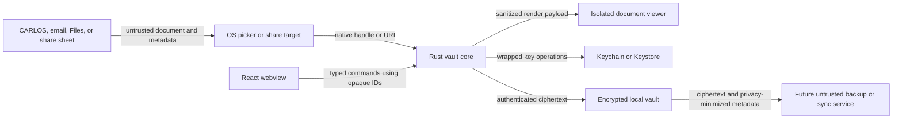

# myCarlos threat model

- **Status:** Durable-vault implementation complete; independent review and release gates open
- **Version:** 0.2
- **Date:** 2026-09-08
- **Initial platforms:** Windows, macOS, Android, and iOS
- **Deferred platform:** Linux, pending review of the documented `glib` backport and device/release validation
- **Data restriction:** Synthetic files only; this model does not authorize PHI use

## Purpose

This document identifies what myCarlos must protect, the trust boundaries an attacker may cross,
credible failure and abuse cases, and the controls and tests required before the application stores
patient records.

The native Tauri application includes the synthetic-data durable-vault slice described in
[`VAULT_FORMAT.md`](VAULT_FORMAT.md); the browser demo remains session-only. Implemented controls
are marked below, but they must not be read as approval for PHI or production use.

## Scope

The model covers:

- vault creation, locking, unlocking, and recovery;
- local PDF import, encrypted storage, viewing, and deletion;
- the React webview, Tauri IPC commands, Rust core, and operating-system services;
- local metadata, thumbnails, temporary files, logs, and crash artifacts;
- future encrypted backup, multi-device enrollment, and synchronization;
- future CARLOS document handoff and provenance verification; and
- build, signing, updating, and third-party dependencies.

It does not approve a PDF renderer, synchronization service, analytics provider, or CARLOS
protocol. The current encryption and passphrase-only recovery design is implemented but awaits
independent review and target-device verification.

## Security and privacy objectives

1. A locked or powered-off device does not disclose document contents or sensitive metadata.
2. A cloud or synchronization provider cannot decrypt patient records.
3. Encryption and recovery keys never enter the React renderer, logs, analytics, or crash reports.
4. Untrusted documents cannot obtain native privileges or escape the document viewer.
5. Native commands expose the minimum capability required and authorize every operation.
6. Tampering, corruption, rollback, incomplete writes, and false provenance are detected.
7. Deletion removes the ability to decrypt the deleted object, including derived artifacts.
8. Security failures are explicit and fail closed without silently destroying recoverable data.
9. The patient can understand when a record is verified, unverified, locked, backed up, or deleted.
10. No production patient data is used until the applicable controls and tests pass review.

## System and trust boundaries

The important trust boundaries are:

| Boundary | Rule |
| --- | --- |
| External source to OS picker | Selection is user intent, not proof that a file is safe or authentic. |
| React webview to Rust | Treat the renderer as untrusted. Validate command, state, identity, size, and object ID in Rust. |
| Rust to OS key storage | Store only the minimum wrapping material and bind access to the intended application/device policy. |
| Rust to local storage | Durable document content, metadata, indexes, and derived artifacts must be authenticated ciphertext. |
| Vault to viewer | Decrypt only after unlock; constrain viewer privileges and prohibit uncontrolled network or native access. |
| Device to backup/sync | Treat the service and transport endpoint as unable to keep plaintext confidential. |
| CARLOS to myCarlos | Verify origin, integrity, freshness, and intended recipient before showing verified provenance. |

## Assets

| Asset | Harm if compromised |
| --- | --- |
| Decrypted documents | Direct disclosure of personal health information. |
| Document titles, tags, dates, thumbnails, and provider names | Sensitive diagnoses and care relationships can be inferred without opening a PDF. |
| Vault data-encryption keys | Complete or object-level vault disclosure. |
| Passphrase-derived and recovery key material | Offline vault compromise or permanent patient lockout. |
| Device-bound wrapping keys and biometric authorization | Unauthorized unlock on a stolen or shared device. |
| Encrypted vault and manifest | Deletion, corruption, rollback, traffic analysis, or offline guessing. |
| CARLOS provenance manifest and signature keys | Forged or misattributed clinical documents. |
| Backup and synchronization state | Cross-device disclosure, rollback, duplicate resurrection, or data loss. |
| Logs, crash reports, clipboard, notifications, and OS snapshots | Secondary disclosure outside the vault. |
| Signing and update credentials | Distribution of a malicious application update to every patient. |

## Threat actors and assumptions

Credible threat actors include a finder or thief of a device, another user of a shared computer,
malware with ordinary user privileges, a malicious document sender, a compromised website or deep
link, a compromised backup provider, a supply-chain attacker, and an attacker controlling a future
synchronization account.

The following limits must be communicated honestly:

- The vault must protect a lost locked device and copied vault files.
- The vault must protect records from the backup or synchronization operator.
- The application cannot guarantee confidentiality while records are visible on a device whose
  operating system or privileged account is already fully compromised.
- OS key stores reduce key-extraction risk but do not replace a vault encryption and recovery model.
- myCarlos can verify that a package was signed by a recognized clinic; it cannot guarantee that the
  clinical content entered by that clinic is medically correct.
- Availability after total device loss depends on the recovery and backup design. Until those are
  implemented and tested, the application must not imply that records are recoverable.

## Risk scale

Risk is initially qualitative because usage, deployment, and recovery designs are not final.

- **Critical:** plausible compromise or irreversible loss of most of a patient's vault, signing
  infrastructure, or recovery authority.
- **High:** disclosure or unsafe modification of one or more records, or escape from an untrusted
  document into native application privileges.
- **Medium:** limited metadata disclosure, local denial of service, or a weakness requiring another
  significant compromise.
- **Low:** minor impact with narrow prerequisites and straightforward recovery.

Residual risk must be rescored after a control is implemented and tested. “Planned” controls do not
reduce current risk.

## Threat register

| ID | Risk | Threat and impact | Required controls | Verification | Status |
| --- | --- | --- | --- | --- | --- |
| KEY-01 | Critical | An attacker copies the vault and guesses the patient passphrase offline. | Unique salt; reviewed memory-hard password KDF; platform-benchmarked work factor; random vault key wrapped by the derived key; no password verifier that makes guessing cheaper. | Password-cracking cost review and tests against copied vault fixtures on every target class. | Argon2id, 15-character minimum, local common-pattern/context screening, and benchmark harness implemented; production breach corpus, physical results and review open |
| KEY-02 | Critical | Recovery becomes a universal backdoor or is easier to attack than the passphrase. | Patient-controlled recovery only; no vendor or clinic recovery secret; high-entropy recovery kit verified at setup. | Recover on every target with the kit and confirm the service cannot decrypt. | Design selected; implementation open |
| KEY-03 | High | Keys leak into the renderer, logs, crash dumps, swap, or long-lived memory. | Perform key operations in Rust/native code; never serialize raw keys over IPC; redact diagnostics; minimize key lifetime; use protected memory/zeroization where supported. | Instrument IPC and logging, force crashes, inspect artifacts, and review memory-handling paths. | Rust boundary, direct zeroizing key buffers, and streaming-I/O cancellation implemented; blocking-provider, crash and artifact review open |
| KEY-04 | High | Biometric unlock bypasses the intended passphrase policy or survives device-account changes. | Biometrics authorize use of a device-bound wrapping key; passphrase/recovery fallback; invalidate as appropriate after biometric or device-credential changes. | Test enrollment changes, fallback, repeated failures, device restore, and copied application data. | Design selected; implementation open |
| KEY-05 | High | A stale key envelope or vault manifest is restored to bypass deletion or revive old access. | Authenticate and version key envelopes and manifests; define rollback detection and device reconciliation. | Restore older fixtures and confirm safe detection rather than silent acceptance. | Open |
| KEY-06 | High | The patient loses the passphrase and permanently loses the only copy of the record. | Patient-held recovery kit, portable authenticated backup, rotation, and explicit custody warnings. | Recovery, rotation, lost-kit, and historical-backup drills using synthetic data. | Permanent-loss warnings implemented; selected recovery and backup implementation open |
| IMP-01 | High | A selected path, URI, symlink, or replaced file makes the app import a different file than the patient chose. | Open once through native code; use handles/content URIs where available; reject links and special files; avoid check-then-open logic; never accept renderer-supplied filesystem paths. | Symlink, race, content-provider, shared-directory, and path-manipulation tests per platform. | Local links/special files rejected, Unix no-follow and Windows reparse-point handle checks implemented, and renderer paths excluded; ordinary-file replacement races/content-provider testing open |
| IMP-02 | Critical | A crafted PDF exploits the parser and reaches vault keys or native commands. | Sandboxed capability-free rendering helper with no vault keys or network; bounded rendered output; prompt renderer updates. | Malformed corpus, known parser regressions, network observation, and attempted IPC/native access from the renderer. | Design selected; implementation open |
| IMP-03 | High | Oversized, recursive, or pathological input exhausts memory, disk, battery, or CPU. | Bounded open handles; constant-memory streaming; vault quota; bounded parsing; cancellation; timeouts; page/image limits; safe cleanup after termination. | Large-file and large-batch imports, PDF bomb, oversized image, excessive-page, low-disk, and cancellation tests. | Pre-open 100-file selection bound, bounded IPC collections/metadata, generated 101 MiB constant-memory test and I/O-boundary cancellation implemented; quota, blocking-provider timeout and parser/viewer limits remain |
| IMP-04 | High | Plaintext remains in temporary files, previews, thumbnails, caches, or failed imports. | Stream into authenticated encrypted storage; keep derived artifacts encrypted; use atomic commit; remove incomplete artifacts. | Interrupt each import stage, restart, and scan application-controlled storage for recognizable plaintext. | Streaming/staging and canary tests implemented; crash matrix open |
| IMP-05 | Medium | Filename, provider, diagnosis, or other metadata leaks before vault unlock. | Encrypt metadata and indexes; use opaque storage names; minimize lock-screen, recent-file, and OS-search integration. | Filesystem and OS-index inspection while locked. | Encrypted manifest and canary test implemented; OS inspection open |
| IMP-06 | High | An ordinary imported PDF is displayed as a verified CARLOS record. | Label manual files Patient imported · Unverified; verify a signed, recipient-bound CARLOS package before showing verified status. | Modify document and manifest fields, use unknown/revoked signers, and confirm the UI cannot show verified status. | Manual-import trust state implemented; approved wording and signed packages open |
| IMP-07 | Medium | The same package is replayed or imported repeatedly, confusing record history. | Stable signed document ID, content hash, idempotent import, and explicit duplicate handling. | Replay identical and modified packages across devices and restores. | Future CARLOS gate |
| IPC-01 | Critical | Compromised React code invokes privileged Tauri commands to read, overwrite, or erase data. | Keep narrowly scoped capabilities; commands accept bounded opaque vault IDs rather than paths; authorize lock state and operation in Rust; require trusted native confirmation for whole-vault reset; no generic read/write/execute command. | Enumerate generated permissions and fuzz every command while locked and with invalid IDs. | Opaque application commands declared in the build manifest and granted only to the main window, collection bounds, no webview plugin/core permissions, native reset confirmation, arbitrary IPC deserialization properties and locked/unknown-ID operation matrix implemented; native harness fuzzing remains |
| IPC-02 | High | XSS or remote content gains the privileges of the main application webview. | Bundle UI assets; restrictive CSP; no remote scripts; sanitize rendered text; isolate document content; review navigation and deep links. | CSP tests, dependency review, injected markup fixtures, and blocked-network assertions. | Production CSP/dev separation, prototype freezing, and hostile-metadata/off-origin browser regression implemented; native navigation/deep-link and viewer isolation tests open |
| IPC-03 | High | A plugin silently expands filesystem, shell, network, or clipboard authority. | Per-window capability files; exact plugin inventory; security review for every permission change; deny unused mobile and desktop scopes. | CI diff/check of capability manifests and generated mobile permissions. | Partially addressed in POC |
| IPC-04 | High | A command returns sensitive paths or error details to the renderer or console. | Patient-safe fixed errors; opaque IDs; no absolute paths; structured redaction at the native boundary. | Force native errors and inspect UI, console, logs, and crash output. | POC returns basename only; broader review open |
| STO-01 | Critical | Vault files or metadata are readable directly from disk or an OS backup. | Authenticated encryption for every durable sensitive object; encrypted metadata/index; random opaque filenames; backup exclusions for any plaintext cache. | Copy storage and backup images, then search for known document and metadata canaries. | Implemented with automated canary coverage; OS-backup inspection open |
| STO-02 | High | Ciphertext or metadata is modified, swapped between records, truncated, or corrupted. | AEAD; bind object ID, type, version, and vault identity as authenticated data; verify before use; safe corruption state. | Bit flips, truncation, object swaps, and cross-vault copy tests. | Bit-flip, truncation, record-swap, cross-vault copy, and one/two-slot manifest tests implemented; physical-device matrix remains |
| STO-03 | High | Crash, low disk, or power loss produces a partially committed record or destroys the previous valid state. | Transactional metadata; redundant generation-bound headers and identical manifest states; unambiguous committed/degraded outcomes; recovery-mode read access; safe orphan cleanup; write-verify-rename/commit sequence. | Terminate the process and inject write failures at persistence boundaries, then restart repeatedly. | Exclusive OS ownership prevents concurrent app instances from overwriting stale state. Subprocess termination and deterministic `NoSpace` matrices cover chunk/staging/rename/manifest/deletion/reset boundaries; physical power-cut and full-filesystem matrix remain |
| STO-04 | High | “Permanent delete” leaves decryptable originals, thumbnails, exports, or synced copies. | Per-object keys or equivalent cryptographic-erasure design; delete wrapped key and derived artifacts; propagate tombstones to backup/sync; explain external exports separately. | Attempt recovery from live storage, backups, caches, and another device after deletion. | Live-vault key removal, ciphertext cleanup, and startup completion of interrupted whole-vault resets implemented; backup/sync/cache verification open |
| STO-05 | Medium | Local filesystem permissions expose or let another account modify the vault. | Private application data directories; restrictive permissions; no shared/external storage for vault objects; integrity verification remains mandatory. | Platform permission inspection and second-user access tests. | Unix mode assertions implemented; Windows/mobile policy and second-user tests remain |
| STO-06 | High | Nonce reuse, partial migration, or format downgrade breaks confidentiality or integrity. | Reviewed versioned envelope format; library-managed nonces where possible; migration transaction and rollback plan; reject unsupported/downgraded formats. | Property tests for uniqueness, migration interruption tests, and old/new version matrix. | v1 rejects unknown header/manifest versions and same-generation divergence; nonce regression sample and migration protocol implemented; target-format interruption matrix awaits v2 |
| UI-01 | High | Decrypted content appears in mobile app-switcher snapshots, notifications, widgets, or lock-screen previews. | Privacy screen on background; suppress sensitive snapshots; notifications contain no PHI by default; lock on defined lifecycle events. | Physical-device background, notification, reboot, and screen-recording review. | Immediate webview concealment implemented; native snapshot/platform and physical-device verification open |
| UI-02 | Medium | Clipboard, share, print, or export leaves uncontrolled plaintext copies. | No implicit clipboard use; explicit export warning and destination; separate audited capability; clearly state that exported copies leave vault protection. | Clipboard monitoring and export/share tests across targets. | Explicit export/screenshot/deletion-limit warnings, partial-provider-destination error, and removal of an interrupted desktop export's staged copy at the next start, unlock or reset implemented; platform clipboard/export/share/provider testing remains |
| UI-03 | High | An unlocked session remains visible on a shared or unattended device. | Five-minute default configurable from one to fifteen minutes; immediate concealment on background; reauthentication for sensitive operations. | Clock, sleep, process-resume, multi-window, and fast-user-switching tests. | Manual/background locking, immediate concealment, clamped persisted 1–15-minute setting with five-minute default, a native idle deadline that drops the keys without the renderer (a transfer counts as native activity while it makes progress), and automatic or background locks that conceal at once during a transfer, lock when it ends, and show its outcome only after the next unlock implemented; a hung webview's last screen staying visible, a source that keeps trickling data, or a file that never finishes opening, keeping the session unlocked (concealed), native privacy controls, reauthentication, and device matrix open |
| UI-04 | Medium | Accessibility defects cause the patient to select, delete, or trust the wrong record. | Screen-reader names/state, focus management, scalable text, keyboard-equivalent operations, non-color trust indicators, confirmations for destructive actions, and undo where safe. | Automated WCAG checks plus manual VoiceOver, TalkBack, Windows, and macOS accessibility evaluation. | Automated WCAG A/AA gates cover browser and durable-vault states; modal focus containment/return and keyboard folder movement are implemented; manual assistive-technology review remains |
| INT-01 | Critical | A forged CARLOS handoff, deep link, or share intent imports attacker-controlled provenance. | Authenticated package format; allow-listed protocol and bounded fields; signature-chain and recipient checks; no key or command in URL parameters. | Fuzz links/intents and test forged, expired, wrong-recipient, and unknown-clinic packages. | Future CARLOS gate |
| INT-02 | High | A valid document for one patient or profile enters another local vault. | Bind intended recipient/profile in signed metadata using privacy-preserving identifiers; require explicit confirmation when binding is unavailable. | Cross-profile and wrong-recipient test matrix. | Future CARLOS gate |
| SYN-01 | Critical | Backup provider, network observer, or account attacker reads records or recovery material. | Client-side encryption before upload; TLS as defense in depth; no server-held plaintext recovery secret; privacy-minimized object names and manifests. | Inspect captured traffic and server-side fixtures; attempt restore using server data alone. | Future sync gate |
| SYN-02 | High | Sync resurrects deleted records or rolls the vault back to vulnerable/stale state. | Authenticated version history, tombstones, conflict rules, replay protection, and visible device state. | Offline concurrent delete/edit, stale device, replay, and restore tests. | Future sync gate |
| SYN-03 | Critical | Attacker enrolls a new device and receives the vault key. | Explicit existing-device or recovery-key authorization; patient-visible device list; revocation; no email-only enrollment for vault decryption. | Account takeover and unauthorized enrollment exercises. | Future sync gate |
| SUP-01 | Critical | Compromised dependency, CI action, or build runner ships malicious code. | Lockfiles; pinned CI actions; minimal dependencies; SBOM; vulnerability and provenance checks; protected release workflow; reproducible-build investigation. | Dependency diff review, artifact provenance verification, and periodic clean-room rebuild. | Lockfiles, commit-pinned Actions, dependency review, production npm audit and reproducible npm/Cargo CycloneDX inventories implemented; protected artifact provenance and clean-room rebuild remain |
| SUP-02 | Critical | Signing or updater key compromise distributes a malicious release. | Offline or hardware-backed signing controls; separation of duties; signed update metadata; rotation and revocation runbook; rollback protection. | Staged malicious/expired/rollback update tests and key-loss exercise. | Design required |
| SUP-03 | High | Analytics, support bundles, or crash reporting exfiltrate PHI or keys. | No analytics by default; field allow-list rather than redaction-only policy; local patient review of support bundles; approved data flow before enabling telemetry. | Seed canary PHI and verify it never leaves through diagnostics. | Future operations gate |
| SUP-04 | High | A known vulnerable platform dependency is treated as supported. | Security gate per target; do not waive affected runtime advisories; publish an explicit supported-platform matrix. | Release pipeline refuses unsupported targets and high/critical unresolved runtime findings. | Linux deferred; other targets open |

## Mandatory design decisions

These decisions block the secure-vault implementation or its promotion:

| Decision | Required outcome | Current status |
| --- | --- | --- |
| D-01 Vault envelope | Versioned authenticated-encryption format for documents, metadata, manifests, and migrations. | v1 and migration protocol implemented; future target-format code/review open |
| D-02 Key hierarchy and KDF | Vault key, per-object key strategy, passphrase wrapping, and platform-benchmarked derivation policy. | Implemented; benchmarks/review open |
| D-03 Recovery | Patient-understandable custody boundary, loss behavior, and new-device restoration. | Patient-held recovery kit and portable backup selected; implementation open |
| D-04 Viewer | Renderer choice, isolation boundary, supported PDF features, update path, cache behavior, and malicious-document testing. | Sandboxed capability-free helper selected; implementation open |
| D-05 Local database | Encrypted index/storage choice, transaction and crash behavior, schema migration, and corruption recovery. | Encrypted manifest and migration protocol implemented; physical crash and future target-format migration review open |
| D-06 CARLOS package | Signed manifest schema, recipient binding, trust store, revocation, expiry, replay, and unverified-import presentation. | Signed recipient-bound package and explicit encrypted sharing selected; implementation open |
| D-07 Backup and sync | Threat model extension covering enrollment, metadata privacy, conflicts, tombstones, rollback, and server compromise. | Portable backup, E2EE sync, append-only history, enrolled-device approval, and immediate deletion selected; implementation open |
| D-08 Diagnostics | Whether telemetry exists at all, allowed fields, consent, retention, support bundles, and incident access. | No telemetry; local redacted patient-exported diagnostics selected |

## Secure Vault v0.1 security gate

The synthetic local-vault vertical slice is not complete until all of the following are demonstrated:

- [ ] A threat-model reviewer and application owner approve the scoped risks and assumptions.
- [ ] D-01 through D-05 are decided and recorded.
- [ ] A synthetic PDF is encrypted before entering application-controlled durable storage.
- [ ] Document content, title, provider, date, thumbnails, and search index are unreadable while locked.
- [ ] Raw keys never cross Tauri IPC or appear in logs and crash artifacts.
- [ ] The vault can be closed, restarted, unlocked, rendered, and deleted on each initial platform.
- [ ] Import interruption at every persistence boundary leaves either the previous valid state or a
      detectable, safely recoverable incomplete state.
- [ ] Malformed and hostile PDF tests cannot access native commands, vault keys, or the network.
- [ ] Wrong-passphrase, corrupted-object, rollback, low-disk, and lost-key paths fail explicitly.
- [ ] Backgrounding and inactivity conceal content and require reauthentication as designed.
- [ ] Storage and OS-backup inspection finds no plaintext canaries.
- [ ] No unresolved critical/high vulnerability affects a shipped runtime dependency.
- [ ] Windows, macOS, Android, and iOS checks pass; no release workflow produces a supported Linux
      artifact before review of the `glib` backport and Linux device/release validation.

Passing this gate permits the next synthetic-data development phase. It does not by itself authorize
real patient data, a patient pilot, CARLOS integration, or production release.

## Review and maintenance

Review this model whenever a native command, Tauri capability, storage format, cryptographic
dependency, PDF renderer, recovery method, network service, CARLOS integration, analytics path, or
supported platform changes. Each pull request affecting a trust boundary must cite the applicable
threat IDs and add or update their verification evidence.

Before a patient pilot, conduct an independent security review and map implemented controls to the
OWASP Mobile Application Security Verification Standard. Clinical, privacy, and regulatory owners
must separately approve intended use and data handling.

## References

- [OWASP threat modeling](https://owasp.org/www-community/Threat_Modeling)
- [OWASP Mobile Application Security Verification Standard](https://mas.owasp.org/MASVS/)
- [Tauri v2 capabilities](https://v2.tauri.app/security/capabilities/)
- [Tauri v2 Content Security Policy](https://v2.tauri.app/security/csp/)
- [Tauri updater security and signing](https://v2.tauri.app/plugin/updater/)
- [Android Keystore system](https://developer.android.com/privacy-and-security/keystore)
- [Apple Keychain Services](https://developer.apple.com/documentation/security/keychain-services)
- [NIST SP 800-63B authentication guidance](https://pages.nist.gov/800-63-4/sp800-63b.html)
- [`glib` advisory GHSA-wrw7-89jp-8q8g](https://github.com/advisories/GHSA-wrw7-89jp-8q8g)
